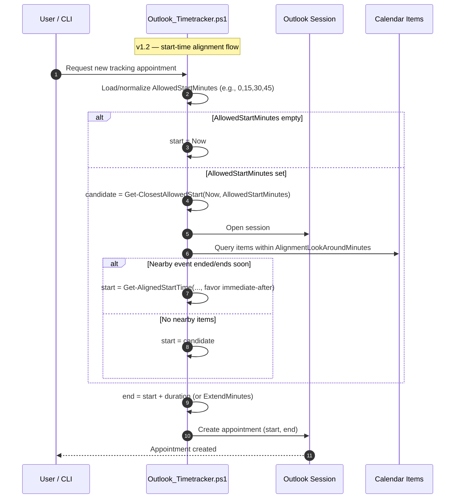

# Outlook-TrackAndBlock

[🇺🇸 Englische Version dieser Datei](/README.md)

PowerShell-Tool mit GUI **und** CLI, das über Outlook private „Tracking“-Termine anlegt/verlängert.  
Dadurch setzt **Microsoft Teams** den Status automatisch auf **„Beschäftigt“** - ideal als Stream-Deck-Action.

## Features

- **Neue Fokus-Blöcke** starten (30/60/90/120 Min) - F1-F4
- **Fixe Startzeiten** - neue Blöcke rasten auf konfigurierbare Minuten (Standard 00/15/30/45) ein und berücksichtigen angrenzende Termine
- **Laufenden Termin fortsetzen** (+30/+60/+90/+120 Min) - F5-F8
- Termine können als privat markiert werden und haben die Kategorie **„Tracking“**
- **Dark-ish** WinForms-Dialog, DPI-aware, Fokus-Fix (AttachThreadInput)
- **CLI-Modus** für direkte Nutzung ohne GUI (z. B. Stream Deck)
- Konsole wird **versteckt**; Start mit `-WindowStyle Hidden`

## Voraussetzungen

- Windows 10/11
- Outlook Desktop (Microsoft 365 / Office)
- PowerShell 5.1 **oder** 7.x (WinForms vorhanden)

## Quickstart

1. Script `Outlook_Timetracker.ps1` aus `/scripts` speichern.
2. Testen:

~~~powershell
powershell.exe -NoProfile -ExecutionPolicy Bypass -WindowStyle Hidden -File "C:\Pfad\Outlook_Timetracker.ps1"
~~~

3. Taste F1/F2/F3/F4: neuen Block starten · F5-F8: laufenden Termin verlängern.

## Stream Deck Integration

- **Aktion:** System → *Programm öffnen*
- **Programm:** `C:\Windows\System32\WindowsPowerShell\v1.0\powershell.exe`
- **Argumente (GUI):**

~~~powershell
-NoProfile -ExecutionPolicy Bypass -WindowStyle Hidden -File "C:\Pfad\Outlook_Timetracker.ps1"
~~~

- **Argumente (CLI - ohne GUI, 90 Min „Deep Work“):**

~~~powershell
-NoProfile -ExecutionPolicy Bypass -WindowStyle Hidden -File "C:\Pfad\Outlook_Timetracker.ps1" -Subject 'Fokuszeit' -StartMinutes 90
~~~

- **Argumente (nur verlängern, +30 Min):**

~~~powershell
-NoProfile -ExecutionPolicy Bypass -WindowStyle Hidden -File "C:\Pfad\Outlook_Timetracker.ps1" -ExtendMinutes 30
~~~

## Konfiguration (im Script Kopfbereich)

- `$CategoryName = "Tracking"` (wird bei Bedarf automatisch angelegt)
- `$DurationsStart / $DurationsExtend` - Button-Minuten
- `$AllowedStartMinutes` - Minutenmarken für den Start (z. B. `@(0,15,30,45)`); Zulässig sind Minuten 0-59; Duplikate werden ignoriert; mit `@()` lässt sich die Rundung abschalten
- `$AlignmentLookAroundMinutes` — Zeitraum in Minuten zum suchen von angrenzenden Termin-Ende (Standard: 10)
- `$BtnWidth / $BtnHeight` - Größe der Buttons
- Theme-Farben (dunkel/dezent) sind als Variablen definiert
- Optional: `$SilentExtendDefault = $true` (MessageBox nach „Extend“ abschalten)

Mit aktivierter Ausrichtung sucht das Script nach Terminen, die gerade geendet haben oder in wenigen Minuten enden, und startet den neuen Block direkt danach; ansonsten wird auf den nächstgelegenen erlaubten Slot gerundet.

## CLI-Parameter (optional)

~~~powershell
-Subject <string>        # Betreff/Name der Aufgabe
-StartMinutes <int>      # Startet sofort einen Block (GUI wird übersprungen)
-ExtendMinutes <int>     # Verlängert den aktuell laufenden Termin
-Private                 # Schalter – markiert den neuen Block als privat (GUI wird vorab angehakt)
~~~

`-StartMinutes` und `-ExtendMinutes` lassen sich nicht kombinieren; gib genau einen positiven Minutenwert für eine der Option
en an. `-Subject` kann auch allein genutzt werden, um die GUI vorab zu befüllen.

## FAQ

**Setzt das Tool „Nicht stören (DND)“ in Teams?**  
Nein - regulär setzt Outlook nur **„Beschäftigt“**. Für echtes Teams-DND bräuchte es separate Maßnahmen (z. B. Windows-Fokusassistent oder UI-Automation).

**Warum „US-Datumsformat“ intern?**  
Outlook-Restrict benötigt das Format `MM/dd/yyyy HH:mm`. Das Script kümmert sich darum.

## Troubleshooting

- **ExecutionPolicy**: Start mit `-ExecutionPolicy Bypass`.
- **Kategorie nicht sichtbar**: In Outlook die Spalte „Kategorien“ in der Kalenderansicht einblenden.
- **Kein laufender Termin erkannt**: Prüfe, ob ein Termin *jetzt* Start ≤ Jetzt < End hat (Serientermine unterstützt).
- **Fokus liegt nicht auf dem Dialog**: Der *Foreground-Fix* ist eingebaut; bei exotischen Desktop-Policies ggf. Stream Deck auf „Als Administrator ausführen“ stellen.

## Architektur

## Datenschutz

- Termine werden **lokal** via Outlook-COM erstellt (keine Cloud-API).
- Es werden **keine Daten extern übertragen**.

## Topics / Tags

`powershell`, `outlook`, `microsoft-teams`, `time-tracking`, `stream-deck`, `calendar`, `windows`, `productivity`, `winforms`, `com-interop`, `focus-time`

## Contributing

Issues/PRs willkommen! Bitte bei PRs:

- kompakte Commits (Conventional Commits optional)
- Kommentar im Code bei Outlook-Interop oder UI-Änderungen
